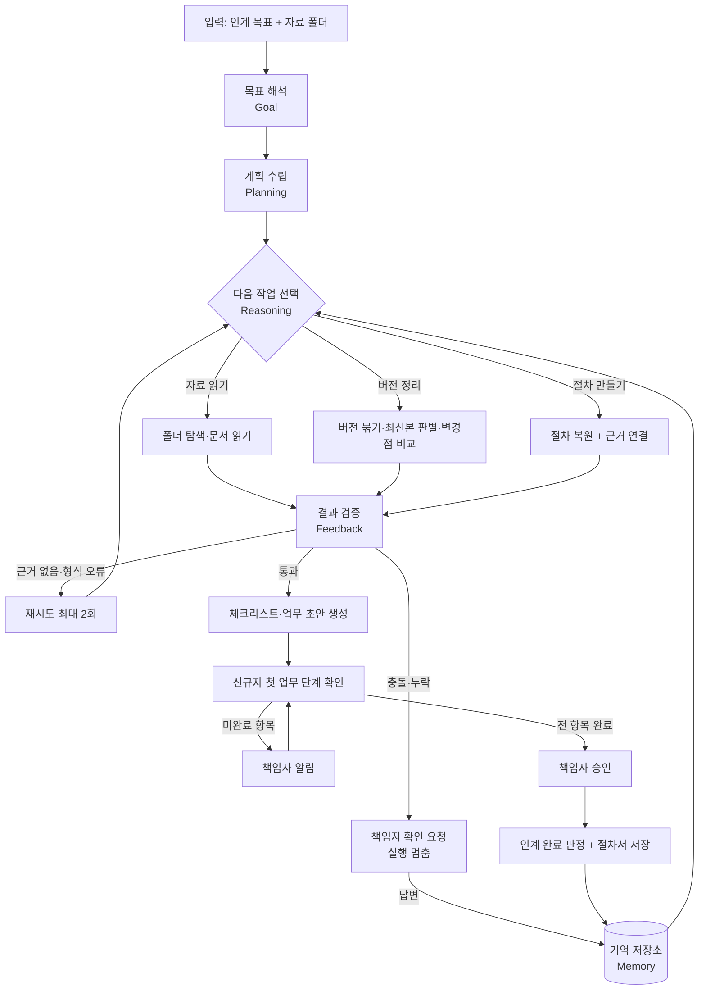

# 일잇다 설계서

작성 2026-09-29 (개발 1일차) · 팀 바톤터치 · 분야 02 업무혁신·생산성 향상 AI Agent
기준: 주관사 설명회 자료와 교육자료 ([요약](../원문/설명회_교육자료_요약.md))

## 1. 한 장 정의 (교육자료의 D1 산출물)

| 항목 | 내용 |
|---|---|
| 문제 정의 | 소규모 사업장에서 담당자가 빠지면 후임자는 남겨진 파일을 뒤져 업무를 익혀야 하고, 그 과정에서 구버전 양식을 쓰거나 필수 단계를 빠뜨린다 |
| 사용자 | 신규자(후임자) 1명, 책임자(대표·관리자) 1명 |
| Agent 역할 | 남겨진 자료에서 최신 절차를 복원하고, 신규자가 첫 업무를 끝낼 때까지 인계를 진행한다 |
| 성과 지표 | 첫 업무 완료 시간, 누락 단계 수, 구버전 양식 사용 여부, 변경점 탐지율, 근거 표시율 |
| 입력 데이터 | 업무 1개에 대한 자료 폴더 (양식·절차 메모·체크리스트·처리 기록, 10~20개) |
| 시연 성공 조건 | 구버전과 최신본이 섞인 폴더를 넣으면, 에이전트가 계획을 세우고 최신본과 변경점을 찾고, 충돌 1건을 책임자에게 물어 답을 반영하고, 신규자가 체크리스트로 첫 업무를 끝내 인계 완료 판정이 난다 |

### 제외 범위

| 제외 | 이유 |
|---|---|
| 회원가입·로그인·권한 관리 | 교육자료가 버리라고 명시. 역할은 화면 전환으로 대신함 |
| 세무·법률 등 전문 판단 | 절차와 양식의 인계만 다룸. 판단은 책임자 몫 |
| 파일 이동·삭제·외부 전송 자동 실행 | 읽기와 새 파일 생성만 함 |
| 업무 2개 이상 동시 처리 | 업무 1개로 End-to-End 완주가 우선 |
| 스캔 이미지 문자 인식, 구형 HWP(바이너리) 완전 지원 | 8일 범위 초과. 읽지 못한 파일은 목록으로 알림 |
| 디자인 고도화 | 기능 시연 우선 |

## 2. 핵심 기능과 우선순위

신청서의 핵심 기능 5개를 유지한다. 1인 팀이므로 End-to-End에 꼭 필요한 것부터 만든다.

| 번호 | 기능 | 우선순위 | End-to-End 필수 |
|---|---|---|---|
| F1 | 변경점 탐지·최신본 판별 | 1 | 예 |
| F2 | 업무 절차 복원 (단계마다 근거 연결) | 1 | 예 |
| F3 | 충돌·누락 확인 요청 (책임자 확인, 미확정 표시) | 1 | 예 |
| F4 | 인계 진행 (체크리스트, 첫 업무 단계 확인, 완료 판정) | 1 | 예 |
| F5 | 기억 (책임자 답변을 저장해 다음 실행에 반영) | 2 | 아니오 |
| F4-보조 | 신규자 이해 확인 문답 | 3 | 아니오 |

주관사 요건은 "주요 기능 약 80% 이상 시연 가능"이다. F1~F4가 되면 5개 중 4개로 80%를 채운다. F4-보조는 4일차 End-to-End가 성공한 뒤에만 만든다.

## 3. Agent 구조

### 3.1 흐름도



### 3.2 6요소 대응

주관사 배점은 요소별 4점씩 20점이다. 요소마다 화면과 실행 로그에 보이는 증거를 만든다.

| 요소 | 구현 | 화면·로그에 보이는 증거 |
|---|---|---|
| Goal | 사용자가 쓴 인계 목표를 구조화(업무명, 신규자, 책임자, 완료 조건) | 해석된 목표 카드. 빠진 항목은 되물음 |
| Planning | 파일 목록을 보고 작업 순서를 계획으로 작성. 상황이 바뀌면 다시 계획 | 계획 목록과 진행 표시 |
| Reasoning | 파일 형식·버전 수·충돌 여부에 따라 도구와 경로를 선택 | 선택 이유 한 줄이 로그에 남음 |
| Tool Use | 아래 도구 표의 도구를 실제 호출 | 호출한 도구, 입력, 결과 요약, 소요 시간 |
| Memory/State | 실행 상태 저장(중단 후 재개), 책임자 답변 저장·재사용 | 두 번째 실행에서 같은 질문을 하지 않음 |
| Feedback | 근거 검증 실패 시 재추출, 실패가 반복되면 '확인 필요'로 분류 | 재시도 횟수와 최종 처리 |

### 3.3 역할 분리

| 담당 | 하는 일 | 이유 |
|---|---|---|
| LLM | 목표 해석, 계획, 절차 추출, 변경 유형 분류, 확인 질문 작성 | 비정형 문서 이해 |
| 규칙 코드 | 파일 읽기, 버전 묶기, 문서 비교, 근거 문장 실존 확인, 필수값·형식 검사, 완료 판정 | 같은 입력에 같은 결과. 환각 차단 |
| 사람 | 충돌 해소, 미확정 판단, 인계 완료 승인 | 책임 소재 |

### 3.4 도구 목록

| 도구 | 입력 | 출력 | 방식 | 기능 |
|---|---|---|---|---|
| scan_folder | 허용된 폴더 경로 | 파일 목록, 해시, 형식 | 코드 | F1 |
| parse_document | 파일 경로 | 본문, 표, 내부 메타데이터 | 코드 | F1, F2 |
| group_versions | 문서 목록 | 같은 문서 계열 묶음 | 코드 | F1 |
| pick_latest | 계열 1개 | 최신본, 판별 근거 | 코드 | F1 |
| diff_versions | 구버전, 최신본 | 바뀐 줄·항목 | 코드 | F1 |
| classify_change | 변경 1건 | 유형(순서·항목·기준값·서식), 영향 | LLM | F1 |
| extract_procedure | 최신 문서들 | 단계 목록 + 단계별 근거 문장 | LLM | F2 |
| verify_evidence | 단계, 근거 문장 | 원문에 실제로 있는지 | 코드 | F2 |
| detect_conflict | 단계 목록 | 충돌·누락 목록 | 코드 + LLM | F3 |
| ask_owner | 질문, 선택지, 근거 | 책임자 답변 또는 '미확정' | 실행 멈춤 후 재개 | F3 |
| build_checklist | 확정 절차 | 체크리스트 파일, 업무 초안 | 코드 + LLM | F4 |
| validate_draft | 업무 초안 | 필수값·형식 검사 결과 | 코드 | F4 |
| track_progress | 단계 완료 입력 | 진행 상태, 미완료 항목 | 코드 | F4 |
| notify_owner | 미완료·승인 요청 | 알림 기록 | 코드 | F4 |
| memory_store | 책임자 답변, 수정 | 저장·조회 | 코드 (SQLite) | F5 |

파일 수정 날짜는 복사만 해도 바뀌므로 최신본 판별에 쓰지 않는다. 판별 순서는 ① 문서가 밝힌 개정번호(모든 버전에 있을 때만) ② 내용 속 가장 최근 날짜 ③ 개정·수정 표시 개수 ④ 다른 버전에 없는 내용의 양 ⑤ 문서 내부 저장 횟수이며, 전부 같으면 확정하지 않고 책임자에게 묻는다.

변경점 비교는 양식의 칸("항목: 값")을 항목 단위로 먼저 비교하고, 나머지 줄은 줄 단위로 비교한다. 항목 단위 결과로 탐지율과 오탐 수를 센다(`scripts/evaluate_changes.py`).

책임자는 확인 요청에 답하는 자리에서 복원된 절차를 검토해 문장을 고치거나 단계를 뺄 수 있다. 고친 단계는 근거가 '책임자 확인'으로 바뀐다.

## 4. 시스템 구성

| 계층 | 선택 | 이유 |
|---|---|---|
| 흐름 제어 | LangGraph | 조건 분기, 실행 멈춤과 재개, 상태 저장을 기본 제공. 신청서 기재와 일치 |
| LLM | Claude (Anthropic API) | 신청서 기재와 일치. 모델명은 설정값으로 분리 |
| 화면 | Streamlit | Python만으로 1인이 빠르게 구현 |
| 저장 | SQLite | 설치 없이 파일 하나로 실행 상태와 기억을 저장 |
| 문서 읽기 | pypdf, python-docx, openpyxl, HWPX(zip+xml) | 신청서의 대상 형식 |
| 테스트 | pytest | 회귀 테스트 자동 실행 |
| 언어 | Python 3.11 이상 | 현재 PC는 3.9.7. 2일차에 설치 필요 |

### 4.1 폴더 구조

```
src/ilitda/
  agent/      흐름 정의, 상태, 노드(목표·계획·판단·검증)
  tools/      도구 표의 도구들
  llm/        LLM 호출, 프롬프트, 응답 기록·재생
  memory/     SQLite 저장소
  safety/     개인정보 가림, 폴더 허용 목록, 문서 속 지시 무시
  ui/         Streamlit 화면
tests/        테스트 케이스
data/sample/  가상 자료 (개인정보 없음)
eval/         블라인드 평가 세트, 채점 코드
docs/         설계서, 구현계획, 테스트 결과, 출처 기록
```

### 4.2 화면

| 화면 | 사용자 | 내용 |
|---|---|---|
| 인계 시작 | 책임자 또는 신규자 | 목표 입력, 폴더 선택, 계획 확인 |
| 확인 요청함 | 책임자 | 충돌·누락 질문에 답변, 미확정 지정, 인계 승인 |
| 내 인계 | 신규자 | 절차서(근거 링크), 변경점, 체크리스트, 단계 완료 입력 |
| 실행 로그 | 심사·개발 | 계획, 도구 호출 순서, 판단 이유, 재시도 |

### 4.3 상태 데이터

| 항목 | 내용 |
|---|---|
| goal | 업무명, 신규자, 책임자, 완료 조건 |
| plan | 작업 목록과 상태 |
| documents | 파일별 본문, 형식, 계열, 최신 여부 |
| changes | 변경점 목록(유형, 위치, 근거) |
| procedure | 단계 목록(순서, 내용, 근거, 상태: 확정·확인 필요·미확정) |
| questions | 책임자 확인 요청과 답변 |
| checklist | 단계별 완료 여부, 완료 시각 |
| log | 도구 호출·판단·재시도 기록 |

## 5. 안전 설계 (데이터·안전·윤리 10점)

| 세부 배점 | 위험 | 대책 |
|---|---|---|
| 데이터·저작권 3 | 자료 출처 불명확 | 빈 양식과 가상 처리 기록만 사용. 제공자 동의와 출처를 기록 |
| | 오픈소스 라이선스 | 사용 패키지와 라이선스를 [출처 기록](04_출처_AI활용_기록.md)에 기재 |
| 개인정보·보안 3 | 자료에 개인정보가 섞임 | LLM 전송 전 주민등록번호·사업자번호·전화번호·계좌번호 형식을 가림 |
| | API Key 노출 | `.env`에만 저장, `.gitignore` 등록, 제출 전 검사 |
| | 임의 폴더 접근 | 사용자가 허용한 폴더만 읽음. 이동·삭제·외부 전송 없음 |
| AI 오류·편향·안전대책 4 | 근거 없는 안내(환각) | 근거 문장이 원문에 실제로 있는지 코드로 확인. 없으면 안내하지 않고 '확인 필요' |
| | 자료 충돌을 임의로 결정 | 책임자에게 확인 요청. 책임자도 모르면 '미확정' |
| | 문서 속 지시문 | 문서 내용은 자료로만 취급. 문서에 적힌 지시는 실행하지 않음 |
| | 전문 판단 대행 | 세무·법률 판단은 범위 밖으로 안내 |

## 6. 실패 대응 (교육자료의 D2 산출물: 예상 오류와 대응)

| 예상 오류 | 대응 |
|---|---|
| LLM API 오류·지연 | 2회 재시도 후 기록된 응답으로 재생. 사용자에게 재생 중임을 표시 |
| 읽지 못하는 파일 | 건너뛰고 '읽지 못한 파일' 목록으로 알림. 나머지로 계속 진행 |
| LLM 응답 형식 오류 | 형식 검사 실패 시 오류 내용을 넣어 다시 요청 |
| 버전 판별 불가 (근거 부족) | 최신본을 단정하지 않고 책임자에게 확인 요청 |
| 빈 폴더·자료 부족 | 필요한 자료 종류를 안내하고 중단 |
| 발표 현장 네트워크 장애 | 재생 모드와 제출 영상으로 대체 |

재생 모드는 실제 호출 때 저장한 응답을 그대로 다시 쓰는 기능이다. 결과를 꾸미지 않으며, 화면과 보고서에 재생 사용 여부를 표시한다.

## 7. 기존 방식과의 차이 (창의성·차별성 10점)

| 비교 대상 | 한계 | 일잇다 |
|---|---|---|
| 범용 생성형 AI에 파일 올리기 | 최신본을 가리지 않음. 근거 검증 없음. 대화가 끝나면 추적도 끝남 | 최신본 판별, 근거 실존 확인, 인계 완료까지 상태 추적 |
| 문서 질의응답(RAG) 챗봇 | 물어본 것에만 답함 | 절차를 스스로 복원하고 빠진 부분을 먼저 물음 |
| 수작업 인수인계서 | 담당자가 이미 떠났으면 작성 불가 | 남겨진 자료만으로 시작 |
| 사내 위키·매뉴얼 도구 | 누군가 써야 채워짐 | 책임자 확인을 거친 절차서가 인계 과정에서 쌓임 |

## 8. 효과 측정 (실용성 15점 중 효과 측정 5점)

| 지표 | 측정 방법 |
|---|---|
| 변경점 탐지율, 오탐 수 | 제3자가 변경점을 넣은 블라인드 평가 세트. 변경 유형과 개수는 평가 전에 저장소에 기록 |
| 근거 표시율 | 안내한 단계 중 근거가 연결된 비율. 코드로 집계 |
| 최신 양식 판별 정확도 | 계열별 정답 대비 |
| 첫 업무 완료 시간, 누락 단계 수 | 같은 자료로 기존 방식(파일만 제공)과 에이전트 사용을 비교 |
| 사용자 검증 | 3명 이상, 확인서에 이름·소속·검증일자·피드백 기록 |

측정값은 실측한 것만 보고한다. 목표에 못 미쳐도 그대로 적고 실패 유형을 분류한다.

신청서에는 사용 테스트를 1~2명으로 적었다. 가점 조건이 3명 이상이므로 3명으로 늘린다.

## 9. 비즈니스 모델 (10점)

| 항목 | 내용 |
|---|---|
| 고객 | 전담 인사·교육 인력이 없는 소규모 사업장 |
| 제공 가치 | 담당자 교체 때 업무 공백 기간과 실수 감소. 인계 과정에서 절차서가 남음 |
| 제공 형태 | 사업장 PC에 설치해 쓰는 방식을 기본으로 함. 자료가 밖으로 나가지 않음 |
| 수익 | 사업장 단위 월 구독. 인계 1건 단위 과금도 검토 |
| 확산 경로 | 세무·노무 사무소처럼 여러 소규모 사업장과 거래하는 곳, 지역 지원기관 |
| 확장 | 업무 종류 추가, 다국어 인계, 퇴사 예정자 인터뷰 기능 |

가격과 시장 규모는 조사하지 않았다. 발표자료에는 근거를 확보한 수치만 넣는다.

## 10. 미정 사항

| 항목 | 결정 시한 | 대안 |
|---|---|---|
| 대상 업무 1개 | 9/30(수) | 자료 협조가 안 되면 공개 구매·계약 규정과 양식으로 구성 |
| API Key 발급 | 9/30(수) | 본인 발급 필요 |
| 알림 방식 | 10/2(금) | 화면 내 알림 기록을 기본으로 하고, 시간이 남으면 메일 연동 |
| 사용자 검증 3명 섭외 | 10/3(토) | 협조 사업장 직원, 지인 |
| 제출용 저장소 분리 방식 | 10/5(월) | 기획 문서(01~08)를 뺀 별도 저장소 |
